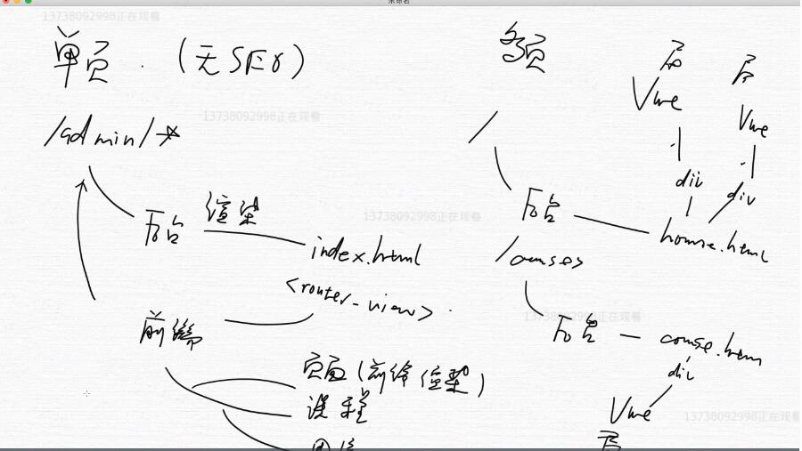

#### 用vue三件事
1. 不要操作DOM元素，要操作组件
```
<td><input type="checkbox" @change="onChangeItem(item,$event)" :checked="selectedItems.filter(i=>i.id===item.id).length>0">
```
2. 组件自己不能修改自己


#### 分类
1. 工程知识：知道用法
    * webpack/parcel
    * scss
2. 语言特性：深入掌握
    * promise
    * vue
3. 抽象的东西：逐渐迭代

#### 工程知识
* [LICENSE选择](http://www.ruanyifeng.com/blog/2011/05/how_to_choose_free_software_licenses.html)
    * 最开放：MIT
* [选择不要上传的文件（第一次就不要push）](https://github.com/Hanqing1996/blog/blob/master/github%E7%9B%B8%E5%85%B3/README.md)
    * .idea
    * node_modules
    * .cache
* 没有全局部安装的包，如何执行命令
```
npx ......
```
* [使用 icon-font 挑选/修改图标](https://xiedaimala.com/tasks/feb587c8-7139-4b1e-95f3-ac429247747a/video_tutorials/88747efd-1306-4752-a8c0-e1b8e63f1862)
    * 左图标->右图标
    * 获取代码：symbol->在线链接
* 打包：parcel build test/* --no-cache --no-minify
    * 把 test 目录下的文件打包到 dist 目录下

#### [parcel](https://parceljs.org/)
1.parcel 的核心是入口文件。如果我们在入口文件 index.html 中引入 vue,sass,ts 等语法，在我们手动安装这些包后 yarn dev,那么 parcel 就会自动编译打包这些文件
2.一旦依赖关系形成，之后我们加其他文件（比如 src），只要保证依赖关系不变即可。
···
非全局安装（报错：未找到命令）注意加 npx
* parcel的作用是打包
    * parcel的服务对象是浏览器
    * 之所以要打包，是因为浏览器不认识 Vue,import等语法，打包其实是把原先的文件解析成浏览器可以看懂的东西
    * 打包后的东西（js,css,html等资源）会被放在 dist 目录下
    * 打包是"顺藤摸瓜"的打包，比如parcel index.html，实际会将g-button.vue,g-icon.vue等都进行打包，因为index.html中出现了这些
* parcel index.html
打包 index.html,并打开浏览器
* paecel build index.html
打包一次，之后改动代码不重新打包，不打开浏览器
* parcel watch index.html
第一次打包后，一旦改动代码，立即重新打包，不打开浏览器。注意执行这条命令后就算输入别的命令（比如执行单元测试），在别的命令执行前也会自动先打包文件，这正是"watch"的意义所在
* 配合 karma 单元测试
    * 只打包一次+执行测试一次（这意味着每改变一次代码就必须再输入一次命令）:parcel build test/* --no-cache --no-minify && karma start --single-run
    * 自动打包+自动执行测试用例（这意味着只要输入一次命令，从此再不必输入，代码自己打包，自己测试，随时看到最新的结果）：parcel watch test/* --no-cache & karma start
        * 注意如果只有karma start的话，那么代码的变化就无法被karma检测到，测试有效性就不好。也就是说 karma 必须有人告诉他要测试的代码变了，它只会自动测试，不会自动打包
* 发布 npm 包后，发现 node 不认识 含有 import 的index.js，因此需要先用 parcel build index.js,再在package.json中将 main 选项改为 dist/index.js
* 之后更新 npm 包，也要 parcel build


* [运行 parcel 时，出现 No entries found 报错怎么办？](https://blog.csdn.net/weixin_42971942/article/details/88345351)
* [[Vue warn]: You are using the runtime-only build of Vue where the template compiler is not available. ]()
根据[ vue 文档](https://cn.vuejs.org/v2/guide/installation.html#%E8%BF%90%E8%A1%8C%E6%97%B6-%E7%BC%96%E8%AF%91%E5%99%A8-vs-%E5%8F%AA%E5%8C%85%E5%90%AB%E8%BF%90%E8%A1%8C%E6%97%B6)描述，需在 package.json 中添加如下内容
```
  "alias": {
    // 只包含运行时版->完整版
    "vue" : "./node_modules/vue/dist/vue.common.js"
  }
```
然后重新运行
```
npx parcel index.html
```

#### CSS 知识点
* css 兼容查询：www.canIuse.com
* 字体不要设置固定 font-size ,应该用变量
* flex布局遇到同排元素不对齐
```
g.button{
    vertical-align: middle;
}
```

#### TravisCI持续集成测试
* 添加.travis.yml
* 把项目 push 到 github
* 在[travis-ci](https://www.travis-ci.org/)添加项目
* 由于travis-ci默认执行 npm run test

#### vue 知识点
* 单文件组件的好处是集成 js,html,style 。让我们能一目了然地知道一个组件的样式，功能，内容。
* 用props为iconPosition设置默认值
```
props:{
    icon:{},
    iconPosition:{
        type:String,
        validator(value){
                    return value=='left'||value!='right'
                }
        default:'left'
    }
}
```
* 属性检查器
如果validate返回false,将在浏览器中返回 Vue warn
```
validator(value){
    return value=='left'||value!='right'
}
```
autoClose
```
autoClose: {
    type: [Boolean,Number],
    default: 5,
    validator: function (value) {
        return (value===false || typeof value === 'Number')
    }
}
```
* 每个Vue组件，都是一个可复用的vue实例。但根Vue实例只有一个
* 组件的class会最终加到组件的根元素上
```
<g-icon class="icon">
</g-icon>
......
<template>
    <svg class="g-icon"></svg>
</template>
```
最终渲染结果为
```
<svg class="g-icon icon"></svg>
```
* propsDate用在单元测试中
```
const button=new Constructor({
    propsData:{
        icon:'settings',
        loading:true
    }
})
```
等效于
```
<g-button icon="settings" :loading="true"></g-button>
```
* el:提供一个在页面上已存在的 DOM 元素作为 Vue 实例的挂载目标
提供的元素只能作为挂载点。所有的挂载元素会被 Vue 生成的 DOM 替换
```
g-button.$mount(div)
```
结果div会被g-button的根元素button替换
    * g-button.$el = <button><svg>...</svg></button>
    * g-button.$el常用在单元测试中，用于访问vue实例的样式，子节点等
* 组件的name作用
```
export default {
    name: "WheelInput"
}
```
1. 配合 vue.js.devtools(chrome插件) 使用
2. 判断A组件的子组件包不包含B
```
mounted() {
    this.$children.forEach((vm) => {
        if (vm.$options.name === 'WheelSider') {
            this.hasSider = true
        }
    })
}
```
3. 对于递归组件,组件名必须与name一致
```
<cascader-items :items="rightItems"></cascader-items>

// 递归调用
export default {
    name: "CascaderItems",// 在HTML中会变为cascader-items
}
```
* scoped
为组件设置 css 作用域（本质是不同组件设置不同ID）
* class绑定
根据一个boolean数组来确定要加载哪些class
```
<div id="app">
    <div :class="[class1,class2]">123</div>
</div>

var vm = new Vue({
    el: '#app',
    data: {
        class1:1&&'9',
        class2:'2'
    }
})
```
结果为 <div class="9 2">123</div>,因为class1为'9',class2为'2'',皆为真值;所以返回数组为[true,true]
```
<div id="app">
    <div :class="[class1,class2]">123</div>
</div>

var vm = new Vue({
    el: '#app',
    data: {
        class1:undefined&&'9',
        class2:'2'
    }
})
```
结果为 <div class="2">123</div>,因为class1为undefined,假值,class2为'2'',皆为真值;所以返回数组为[false,true],如果为true,则class名有效


#### 发布 wheel 包（需FQ）
1. 更新 package.json
2. 在 package.json 里将版本号改为 0.0.1，等我们做完了再改成 1.0.0
3. 创建 index.js，在 index.js 里将你想要导出的内容全部导出
   * export {Button,ButtonGroup,Icon}
4. 去 https://www.npmjs.com/ 注册一个账户
5. 确认一下邮箱（必须）
6. 在项目根目录运行 npm adduser
7. 如果错误提示里面含有 https://registry.npm.taobao.org 则说明你的 npm 源目前为淘宝源，需要更换为 npm 官方源（https://registry.npmjs.org/）
   * npm config list,修改npmrc实现
8. 运行 npm publish
   * 报错：You do not have permission to publish "package-demo".说明包重名了，在package.json修改name
   * 允许先publish,再push。因为publish是从本地上传的
   * 每次 bump version 后记得修改 package.json 的 version,再publish
   * 由于 node 不认识 import,我们需要每次需要先 npx parcel build index.js，再publish


#### 组件注册
注册的目的只有一个，使得组件可以被调用
* 全局注册
全局注册的组件在各自内部也都可以相互使用。
```
import Vue from 'vue'
import Button from './button'
import Icon from './icon'
import ButtonGroup from './button-group'

Vue.component('g-button', Button)
Vue.component('g-icon', Icon)
Vue.component('g-button-group', ButtonGroup)
```
* 局部注册
想要在 g-button 的 template 内使用 g-icon,就要在 g-button 中局部注册 g-icon
```
import Icon from './icon'

export default {

    components:{
        'g-icon':Icon
    }
```
等效于以下全局注册
```
import Button from '../src/button'
import Icon from '../src/icon'

Vue.component('g-button', Button)
Vue.component('g-icon', Icon)
```
* :value与value
    * 接收变量，用 :value。接收字符串，用 value。也就是说，:是被动添加的
    * :span="2" 表示传递的是数值2, 而 span="2" 表示传递的是字符串"2"
    * :loading="false" 表示传递的是布尔量false, 而 loading="false" 表示传递的是字符串"false"
* class 绑定
```
<g-input value="王五" error="姓名不少于两个字"></g-input>
......
<template>
    <div class="wrapper" :class="{errorstyle:error}">
        <input type="text">
    </div>
</template>
......
props:{
    error:{
        type:String
    }
}
......
&.errorstyle {
    > input { border-color: $red; }
}
```
等价于
```
<g-input value="王五" error="姓名不少于两个字"></g-input>
......
<template>
    <div class="wrapper" :class="{error}">
        <input type="text">
    </div>
</template>
......
props:{
    error:{
        type:String
    }
}
......
&.error {
    > input { border-color: $red; }
}
```
* 使用 template 避免引入多余的 标签
```
<span v-if="error">
    <Icon name="settings" class="icon"></Icon>
    <span>{{error}}}</span>
</span>
```
等价于
```
temp
```
第二种写法更好，因为没有引入多余的标签，至于 template，它会像雪一样融化


#### vue 生命周期
[测试](https://www.jianshu.com/p/b88572d8f80a)

1. create:vue实例被创建；
    * beforeCreate：
    * created：
2. mount:vue实例被挂载到真实的DOM节点；
    * beforeMount：
    * mounted：
    * 每刷新一次页面，就重新 create 和 mount 一次
    * css,innerHTML这些东西只有在实例被挂载之后才能看到，之前是undefined
3. update:当vue实例里面的data数据变化时，触发组件的重新渲染
    * beforeUpdate：
    * updated：
4. destroy:vue实例被销毁
    * beforeDestroy：
    * destroyed：

#### created 和 mounted 的区别
* created 类似于
```
var div=document.createElement('div')
```
* mounted 类似于
```
document.body.appendChild(div)
```
* 父子 created 和 mounted 顺序
```
father.created
children.created
children.mounted
father.mounted
```

#### scss语法
* &
```
a {
  font-weight: bold;
  text-decoration: none;
  &:hover { text-decoration: underline; }
  body.firefox & { font-weight: normal; }
}
```
编译为
```
a{
  font-weight: bold;
  text-decoration: none;
  }
a:hover {
  text-decoration: underline;
}
body.firefox a {
  font-weight: normal;
}
```
* 声明变量
```

$height: 32px;
.wrapper {
    > input {
        height: 32px; // 使用变量 height
    }
}
```

#### grid 怎么用
* span 表示跨度,gutter 表示空隙长度
```
<g-row gutter=6>
    <g-col span=12></g-col>
    <g-col span=12></g-col>
</g-row>
<g-row gutter=10>
    <g-col span=8></g-col>
    <g-col span=8></g-col>
    <g-col span=8></g-col>
</g-row>
```
#### Tab 怎么用
* element
```
<g-tabs>
    <g-tab-item label="A">
        A内容
    </g-tab-item>
    <g-tab-item label="B">
        B内容
    </g-tab-item>
    <g-tab-item label="C">
        C内容
    </g-tab-item>
</g-tabs>
```
 * 更好的一种
 selected 表示被激活的 g-tabs-item g-tabs-pane
```
<g-tabs selected='tab1'>
    <g-tabs-head>
        <g-tabs-item name=“tab1”>A</g-tabs-item>
        <g-tabs-item name=“tab2”>B</g-tabs-item>
    </g-tabs-head>
    <g-tabs-body>
        <g-tabs-pane name=“tab1”>A内容</g-tabs-pane>
        <g-tabs-pane name=“tab2”>B内容</g-tabs-pane>
    </g-tabs-body>
</g-tabs>
```


#### 响应式
* 页面缩小时col的offset.span随之变化

#### 重构
* 重复两次及以上的代码
* 一眼看不懂的代码
    * 排版复杂
* 提取变量法


#### 命名规范
HTML中的
```
<g-col :narrow-pc="{span:6,offset:6}"></g-col>
```
对应col.vue中的
```
props: {
    narrowPc:{
        type: Object
    }
}
```
-p对应P,即vue会把-后的第一个字母改为大写


#### innerHTML 和 outerHTML
```
<div id="app">
    <div class="child"></div>
</div>

console.log(document.getElementById('app').innerHTML) // <div class="child"></div>
console.log(document.getElementById('app').outerHTML) // <div id="app"><div class="child"></div></div>
```

#### 打印出来的东西不一定是对的，因为可能在我们预想的变化发生之前，打印就执行了


#### vue 的渲染（created 与 mounted）过程
* 普通 Dom 元素的渲染过程
```
const div=document.createElement('div')
document.body.appendChild(div)
```
* Vue 实例的渲染过程
```
const div=document.createElement('div')
const child=document.createElement('div')
div.appendChild(child)
document.body.appendChild(div)

console.log(child.outerHTML) // 打印出的是 child 没有 mounted 时的状态

child.$mount() // 异步执行
div.$mount() // 异步执行
```

#### [Toast 需求分析](https://xiedaimala.com/tasks/b59fb65d-2450-44c0-8078-51612dbbcc50)


#### 工程问题
* 直接改 Vue.prototype好不好?
    * 不好,可能覆盖用户到方法（侵入性太强）
* 在组件中写 import Vue from Vue 好不好
    * 不好,不能确定用户需要引入的是 Vue,可能是Vue2

#### Vue 开发插件
1. [install(轮子开发者写的,用户不能写入内容)](https://github.com/Hanqing1996/vue-wheels/blob/master/src/plugin.js)
2. [use(用户填入他自定义的参数)](https://github.com/Hanqing1996/vue-wheels/blob/master/src/app.js)


#### 组件的 props 的 type 如果是 Object(包括 Array)
则该 props 的 default 必须 return 一个对象
```
closeButton:{
    type:Object,
    default:()=>{
        return {
            text:'关闭',
            callback:()=>{}
        }
    }
}
```

#### this.$destroy()不会把this.$el从文档中移除
正确删除姿势
```
this.$el.remove()
this.$destroy()
```
#### callback的回传
* 用户定义
```
callback: (toast) => {
    console.log('用户说他知道了')
    toast.log() // log 是组件的一个方法
}
```
* 组件内调用
```
this.closeButton.callback(this)
```

#### 怎么知道各个浏览器对 include 的兼容性
1. MDN include
2. 拉到最低下，就能看到浏览器兼容性情况


#### 父组件向子组件传递数据
```
    <div id="father">
        <child></child>
    </div>

Vue.component('child', {
        data: function () {
            return {
                gutter:0
            }
        },
        template: '<div>子组件的gutter:{{gutter}}</div>',
    })

    var vm = new Vue({
        el: "#father",
        data: {
            gutter: 10
        },
        mounted() {
            this.$children.forEach((vm2)=>{
                vm2.gutter=this.gutter/2;
            })
        }
    })
```
结果为
```
<div id="father">
    <div>子组件的gutter:5</div>
</div>
```

#### 顺序
* $slot 要在　$mount() 前面
* $emit() 要在　$destory()前面

#### Vue 实例
```
let vm=new Vue({
    data: {
    }
})

vm.$mount(document.getElementById('app'))　//　识别
```
等效于
```
let vm=new Vue({
    el:'#app'
    data: {
    }
})
```


#### extend　与　constructor
```
let Constructor=Vue.extend(Button)
let vm3=new Constructor().$mount(document.getElementById("app4")) // 替换
```
等效于
```
let Constructor=Vue.extend(Button)
document.getElementById("app4")
```


#### $mount()
1. 用new创建vue实例
```
<div id="app">
    <g-button></g-button>
</div>
```
```
let vm=new Vue({})
vm.$mount(document.getElementById('app'))　//　识别app下的<g-button>
```
等价于
```
let vm=new Vue({
    el:document.getElementById('app')
})
```
2. 通过constructor动态添加vue实例(测试用例及插件常用)
```
<div id="app">
    <div id="app2">
    </div>
</div>
```
```
let Constructor=Vue.extend(Button)
let vm4=new Constructor().$mount(document.getElementById("app2")) // 用组件内容替换app2
```
结果为
```
<div id="app">
    <button data-v-d7f0df=""></button>
</div>
```
而
```
let Constructor=Vue.extend(Button)
let vm4=new Constructor().$mount()
document.getElementById("app2").appendChild(vm4.$el) // vm4.$el成为app2的子元素
```
结果为
```
<div id="app">
    <div id="app2">
        <button data-v-d7f0df=""></button>
    </div>
</div>
```

#### 无法被销毁的$vm.el
```
let Constructor=Vue.extend(Button)
let vm=new Constructor().$mount(document.getElementById("app"))

vm.$el.remove()
console.log(vm4.$el) // <button data-v-d7f0df=""></button>
vm.$destroy()
console.log(vm4.$el) // <button data-v-d7f0df=""></button>
```

#### vm.$el.remove()
vm.$el.remove()是将vm.$el移出document.body
```
<div id="app">
    <div id="app1"></div>
</div>

let Constructor2=Vue.extend(Button)
let vm4=new Constructor2().$mount(document.getElementById("app"))

console.log("remove前vm4.$el.parent",vm4.$el.parentNode) // <div id="app"><button data-v-d7f0df=""></button></div>
vm4.$el.remove()
console.log("remove后vm4.$el.parent",vm4.$el.parentNode) // null
```

#### 简化
* autoClose为true时必须传入autoCloseDelay的数值,为false时不需要传入autoCloseDelay
```
autoClose: {
    type: [Boolean,Number],
    default: 5,
    validator: function (value) {
        return (value===false || typeof value === 'Number')
    }
},
```

#### vm.$el.querySelector 是取子元素
```
<template>
    <div class="toast" :class="toastClasses">

        <slot v-if="!enableHTML"></slot>
        <div v-else="enableHTML" v-html="$slots.default[0]"></div>

        <span class="line"></span>
        <span class="close" v-if="closeButton" @click="onClickClose">
            {{closeButton.text}}
        </span>
    </div>
</template>

console.log(vm.$el.querySelector('.toast')) // null
console.log(vm.$el.querySelector('.close')) // <span>xxxx<span>
```

#### [.sync修饰符](https://cn.vuejs.org/v2/guide/components-custom-events.html#sync-%E4%BF%AE%E9%A5%B0%E7%AC%A6)
对于
```
this.$emit('update:title', newTitle)
```
下面两种写法等价
```
<text-document :title="doc.title" @update:title="doc.title = $event"></text-document>
```
```
<text-document :title.sync="doc.title"></text-document>
```
也就是说sync的作用是让 title="doc.title" 异步执行多次（响应式）

#### selected
* 使用tabs组件，在index.html中使用了:selected.sync=selectedTab
* 使用slides组件，在demo.vue中使用了:selected.sync=sliderSelected
> 也就是说,demo里的sliderSelected不仅表示默认选项，还表示当前选中的选项

> 我们要注意sliderSelected为"",也就是没有默认选项的情况


子组件的事件触发父组件更新selectedTab
```
<g-tabs :selected="selectedTab" @update:xxx="selectedTab=$event">
```
等价于
```
<g-tabs :selected.sync="selectedTab">
```
只有在demo.vue,index.html里可以用sync


#### vm.$on() vm.$emit()
* vm.$on('click1',callback):为实例设置监听事件click1
```
vm.$on('click1',callback)
等价于在index.html中这么写
<g-button @click1="callback"><g-button/>
```
* vm.$emit('click1'):触发实例的click1事件
```
// 组件g-button内部
<button @click="$emit('click1')"></button>
则
vm.$el.querySelector('button').click()会触发
```

#### 父子组件通信
* 父组件会通过 props 向下传数据给子组件
* 当子组件有事情要告诉父组件时会通过 $emit 事件告诉父组件

#### vue的props和data有什么区别?
```
function fn(prop1,prop2){
    var data1,data2
}
```
不允许的行为
```
function fn(prop1,prop2){
    prop1++
}
```
* props:需要用户(前端开发者)传值,props不允许组件自己修改(要修改,必须先$emit到父组件,再由父组件传入子组件)
    * 事实上如果修改了,vue会给出警告
    * 有的值（比如col.gutter,slides-item.visible）属于props,但我们无法直接，在父组件的mounted里进行传值会收到警告,于是我们不得不用data
* data:不需要用户(前端开发者)传值,data由组件自己修改更新(父组件少传一个参数,起到减少耦合的作用)
    * sider.vue 的　visible
    * tabs-item.vue 的　active
* 但是有的时候传不了 props 只能用 data,比如slide-item的visible    

#### 框架的作用
* 使团队中的傻逼也写不出垃圾代码
    * 提高代码平均质量


#### vm.$options.name 和　vm.name
```
export default {
    name: "Wheelxxx", // vm.$options.name
    props: {
        name: { // vm.name
            type: String,
            required:true
        }
    }
}
```


#### v-if　
* 先执行js代码再执行[更新UI]任务
```
<div id="father">
    <child v-if="show" id="block">hahaha</child>
    <button @click="changeShow">点我</button>
</div>

Vue.component('child', {
        data: function () {
            return {
            }
        },
        template: '<div>hahaha</div>',
        mounted () {
            // 此时[更新UI任务]已完成
            console.log(`${Date.now()}拿到${document.getElementById('block').outerHTML}:`)
        }
    })

    var vm = new Vue({
        el: "#father",
        data: {
            show: false
        },
        methods: {
            changeShow:function(){
                this.show=true
                // 发现this.show变为true,则新增一个[更新UI任务]到任务队列，执行完下面的js代码再更新UI
                this.$next
                console.log(`${Date.now()}拿到${document.getElementById('block').outerHTML}:`)
            }
        }
    })
```
* $nextTick
```
methods: {
    changeShow:function(){
        this.show=true
        // 把js代码放在[更新UI任务]后面
        this.$nextTick(()=>{
            console.log(`${Date.now()}拿到${document.getElementById('block').outerHTML}:`)
        })
    }
}
```


####　添加组件实例的方法
```
// 一般写法：vm是一个vue实例,不是Button的实例
Vue.component('g-button', Button)
let vm=new Vue({
})
vm.$mount(document.getElementById("app"))// vue实例挂载到app上，即识别app内容


// 动态添加组件实例(多个)：vm2是一个vue实例,不是Button的实例
let div=document.getElementById("app2")
div.innerHTML=`
    <g-button>第一个slot内容</g-button>
    <g-button>第二个slot内容</g-button>
    `
const vm2=new Vue({
    el:div // vue实例挂载到app2上，识别app2内容
})


// 创建组件实例(常用于测试用例中)：vm4是组件Button的实例
let Constructor2=Vue.extend(Button)
let vm4=new Constructor2({
        propsData:xxx // 赋予组件props(模拟父组件给子组件传递props),注意Button的一切data,method　vm4都有
    }).$mount(document.getElementById("app6")) // app6被替换
```

#### 各个组件总结(组成内容见[app.js](https://github.com/Hanqing1996/vue-wheels/blob/master/src/app.js))
* button
    * 组件局部注册
    * 属性检查器
    * $emit
    * v-if
    * vm.$on():为组件实例设置监听事件
    * 测试callback
    * "[Vue warn]: Avoid mutating a prop directly since the value will be overwritten whenever the parent component re-renders. Instead, use a data or computed property based on the prop's value. Prop being mutated: "gutter""
    * button-group 检查当前组件实例的子元素是不是 button
    * svg
---
* input
    * v-model
---
* grid
    * col 组件绑定style
    * 把父组件 row 的 gutter 传递给子组件 col
---
* default-layout
    * 判断 layout 组件的子组件包不包含 sider
---
* toast
    * 插件plugin.js开发与使用
    * 动态创建 vue 实例
    * 对象类型的 props 的 defalut 应该写成函数
    * callbak 的回传组件信息功能
    * 向组件的 slot 中插入 HTML 内容
    * $emit实现toast在被关闭前触发beforeClose执行callback
    * 测试callback
    * v-on:click.native
---
* tabs
    * tabs-head:多个slot
    * Eventbus实现组件间通信
    * $emit传递多个参数
    * getBoundingClientRect()
    * $refs()
    * tabs-item 绑定 class
---
* popover
    * [@click.stop阻止事件冒泡](https://github.com/Hanqing1996/vue-wheels/blob/master/src/popover.vue)
    * ref注册DOM元素或组件
    * setTimeout让"设置document的监听事件"这个动作发生在冒泡结束之后
    * 动态绑定事件
    * slot-scope
    * 单向数据流(设计模式)
---
* cascader
    * v-for
    * cascader-items:递归组件
    * 正确使用computed
        * level2Items随selectedLevel1改变而更新,那level2Items为计算属性
        * selectedLevel1放在data而不是computed里面,是因为selectedLevel1是用户点击选择从而更新的,不是随其它数据更新而更新的
        ```
          <div class="label" v-for="item in items">
              <div @click="selectedLevel2=item">{{item.name}}</div>
          </div>

          data() {
              return {
                  selectedLevel2:null
              }
          },

          computed: {
              level3Items: function () {
                  // 注意selectedLevel2可能是用户选择的,一开始为null，所以要加以判断
                  if (this.selectedLevel2) {
                      return this.selectedLevel2.children
                  } else return [];
              }
          }
        ```
---
* slides
    * 用操作组件代替操作DOM元素（努力享受vue的红利）
    ```
    <g-slides>
        <div class="box">1</div>
        <div class="box">2</div>
        <div class="box">3</div>
    </g-slides>
    
    // 操作DOM元素
    this.vm.$el.children...
    ```
    改为
    ```
      <g-slides>
          <g-slides-item>
              <div class="box">1</div>
          </g-slides-item>
          <g-slides-item>
              <div class="box">2</div>
          </g-slides-item>
          <g-slides-item>
              <div class="box">3</div>
          </g-slides-item>
      </g-slides>
  
    // 操作子组件
    this.vm.$children...
    ```
    * 用 enter-active,enter,leave-to 代替 update,computed 进行样式切换
    * update()
    * 处理props默认参数（即"父组件不传入参数,而props的default又不是静态的"这种情况）
    ```
      updateChildren() {
          // 与其修改props的默认值，不如在知道props的用处后修改对应变量的默认值
          let selected = this.selected || this.$children[0].name
          this.$children.forEach((item) => {
              item.selected = this.selected
          })
      }
    ```    
    * slidesSelected不仅表示默认选项，还表示当前选中的选项
    * 移动端touch事件
* nav
    * 通过依赖注入（root）实现跨级调用    
    * 使用指令clickOutside
    ```
    // 点击除.g-sub-nav外的其他位置，则触发closePopover
    <div class="g-sub-nav" v-click-outside="closePopover"></div>
      import clickOutside from '../../clickOutside'
  
      export default {
          directives:{clickOutside},
          methods:{
              closePopover(){
              }
          }
    ```
* table
    * watch  
  
#### vue的意义
操作DOM=>操作组件！！！

#### 设计模式
* 发布订阅模式
```
this.eventBus&&this.eventBus.$emit() // 发布

this.eventBus&& this.eventBus.$on() // 订阅

this.eventBus.$off() // 取消订阅
```
#### 单向数据流
* 定义（关键就一句话：组件不可以自己修改自己）
1. A发起更新,A更新自己:不可以
2. A可以更新B,B可以更新B:不可以
3. 节点间数据传递通过"节点.$emit('update'),事件中心eventBus.$on('update'),vue数据响应"实现
总之一点，两个相邻节点(组件)不能形成闭环

* 单向数据流的问题
有几个地方用到n,就要传几次n(重复,浪费)

* 仿造eventBus事件中心的模式,可以将store设置为数据存储中心,解决数据冗余传递的问题

#### store


#### 正交
一个组件的props必须正交

#### 造轮子原则
1. 你不能要求组件容器的style不能有什么,必须有什么
2. 组件内部的元素不能用@eventName.stop,因为可能用户需要利用事件冒泡,在点击组件内部的元素时触发添加在组件上的事件
3. 组件slot的DOM元素只能传递接口属性,不能加class,Id之类的


#### 在组件上加事件
* [原生的事件是无法直接添加到组件上的](https://cn.vuejs.org/v2/guide/components-custom-events.html#%E5%B0%86%E5%8E%9F%E7%94%9F%E4%BA%8B%E4%BB%B6%E7%BB%91%E5%AE%9A%E5%88%B0%E7%BB%84%E4%BB%B6)
```
<g-button @click="onClick"></g-button>
```
是没用的
1. 想要在组件上加原生的DOM事件，必须使用native修饰符
```
<g-button  v-on:click.native="close">close</g-button></div>
```
2. 通过$emit触发组件上的事件
```
<g-button @beEmited="xxx">
```
beEmited事件是g-button内部的元素点击事件通过emit触发的
```
<template>
    <button @click="$emit('beEmited')"></button>
</template>
```

#### [表驱动编程](https://xiedaimala.com/tasks/d746d4c2-5f33-49c8-98b5-ff5c6f22b10b/video_tutorials/2838ce98-d198-4e81-8b93-793368c6439b)

#### slot
* [.$slots 要放在 $mount() 之前](https://github.com/Hanqing1996/vue-wheels/blob/master/src/plugin.js)
* 向组件的slot中插入HTML内容
    * 这是一种危险的行为(阻止事件冒泡也是一种危险的行为)
    * [实现方法](https://github.com/Hanqing1996/vue-wheels/blob/master/src/toast.vue)
    ```
    <div v-html="$slots.default[0]"></div>

    vm.$slots.default=['这是<strong style="color: blue">toast</strong>信息']
    ```
* slot-scope
```
<template slot="content" slot-scope="{close}">
    <div>give you anything　<g-button  v-on:click.native="close">close</g-button></div>
</template>
```
```
<slot name="content"　:close="closeContent"></slot>

methods: {
    closeContent(){
        console.log('oh close');
        this.visible=false// 关闭content
    }
}

```
* slots外部一般用一个标签包裹起来
```
<template>
    ...
    <div class="wrapper">
        <slots><slots>
    </div>
</template>
```

####
* 在组件内部注册DOM元素
```
<template>
    <div class="popover" ref="popover">
</template>

this.$refs.popover.addEventListener('click',this.onClick)　// this.$refs.popover是一个DOM元素
```
* 在父组件中注册子组件(测试用例)
```
<g-popover trigger="click" ref="a">
    <template slot="content">
    弹出内容
    </template>
    <button>点我</button>
</g-popover>

const popOver=vm.$refs.a　// popOver是一个vue实例
const button=popOver.$el.querySelector('button')
```
#### 父组件与组件通信
* 父组件给子组件传递props(常见的情况是用户在index.html的组件里添加属性)
```
<g-collapse :single="true">
    <g-collapse-item title="标题1" name="1">内容1</g-collapse-item>
    <g-collapse-item title="标题2" name="2">内容2</g-collapse-item>
    <g-collapse-item title="标题3" name="3">内容3</g-collapse-item>
</g-collapse>
```
* 父组件根据子组件情况修改父组件data
```
mounted() {
    this.$children.forEach((vm) => {
        if (vm.$options.name === 'WheelSider') {
            this.hasSider = true
        }
    })
}
```
* 父组件挑选符合条件的子组件,修改子组件data
```
mounted() {

    // 把父组件的 gutter 传递给子组件
    this.$children.forEach((vm) => {
        vm.gutter = this.gutter
    })
}
```
* 父组件与符合条件的子组件通信
```
this.$children.forEach((vm)=>{
    if(vm.$options.name==="WheelTabsHead"){
        vm.$children.forEach((childVm)=>{
            if(childVm.$options.name=="WheelTabsItem"&&childVm.name==this.selected){
                this.eventBus&&this.eventBus.$emit('update:selected', this.selected,childVm)
            }
        })
    }
})
```
注意,由于父组件和子组件挂载顺序的原因,所以在父组件的mounted中进行父子通信是最合适的


#### [正确的数据流总是单向的](https://xiedaimala.com/tasks/f81c1fde-03fd-4b23-8ae8-891f046e63e6/video_tutorials/9853353e-ef49-4fe6-bcb6-cdbb79c6f4cb)
错误的数据流
```
methods:{
    toggleContent(){
        this.open=!this.open
        console.log(`${this.title}发起了更新`);
        this.eventBus&&this.eventBus.$emit('update:selected', this.title)
    }
},
created() {
    this.eventBus&& this.eventBus.$on('update:selected',(title)=>{
        console.log(`${this.title}被更新了`);
        this.open=title === this.title
    })
}
```
某个组件发起了更新又更新了自己,这会造成数据回流,是不合理的(一个组件不能更新自己)
```
标题3发起了更新
collapse-item.vue:38 标题1被更新了
collapse-item.vue:38 标题2被更新了
collapse-item.vue:38 标题3被更新了
```
正确的数据流示范,见collapse组件


#### 部署到github
先生成静态文件，再部署到github
```
yarn run docs:build
yarn run deplosh
```


#### 学习　vuepress
1. 预览文档标题
2, 遇到bug,先google


#### cascader 需求分析


#### 组件的　props 不能以 data-　开头


#### 如何解决bug
1. 产生bug的原因肯定是过去某段时间内某个错误举动
2. 使用新工具产生的bug,可能需要查阅文档解决,所以在使用工具前应该浏览一遍文档的title
3. error提示可以告诉我们项目在进行到那一步的时候出错了

#### @click可以带参数
```
<div v-for="item in source">
    <div @click="setLevel2Source(item)">{{item.name}}</div>
</div>

methods:{
    setLevel2Source(item){
        this.level2Source=item.children
    }
}
```
```
* 如果参数有且只有event，$event可以省略
```
<input type="checkbox" @change="onChangeItem>

onChangeItem(e){
    console.log(e.target.checked);
}
```
* 如果参数不只有event，$event不可以省略
```
<input type="checkbox" @change="onChangeItem(item,$event)>

onChangeItem(item,e){
    console.log(item);
    console.log(e.target.checked);
}
```

版本以0.开头：超级不稳定


#### 装yarn后,package.lock.json不能留


#### [解决：Error: ENOSPC: System limit for number of file watchers reached](https://github.com/guard/listen/wiki/Increasing-the-amount-of-inotify-watchers)


#### [vue中数组的变动不是响应式的](https://cn.vuejs.org/v2/guide/list.html#%E6%B3%A8%E6%84%8F%E4%BA%8B%E9%A1%B9)


#### 指令(用于封装DOM操作)
````
<div　ref="cascader" @clickOutside="close"></div>
````
点击除cascader外的其它位置,则关闭popover,并自动移除对其它位置的监听

// 原先:触发onclickTrigger后,设置对其它位置的监听
// 使用指令:一开始就设置对其它位置的监听(就算不用指令,这种思路也是正确的)


####　在HTML中,等号左边不支持大小写,右边支持
```
<div :load-data="loadData"></div>
```

#### @welcome='xxx'的含义
表示事件订阅,等价于
```
this.$on('welcome',xxx)// xxx为一个回调函数
```

#### vue的原型链类图


#### 状态管理
* [$on(),$emit(),eventbus的由来](https://xiedaimala.com/tasks/2f5d184a-0f2b-4b20-9317-40ad22af784d/video_tutorials/468647fd-5ec8-433d-be52-2eb0c081e36d)

* 什么是状态(面试)

* 状态分类(是否存入数据库)
1. UI状态
2. 用户状态

#### 同名死循环
count.vue组件
```
export default {
    name: "count"
}
```
在其他组件中注册count组件
```
import count from './src/components/count'
```
那么控制台会报错
```
Maximum call stack size exceeded
```

#### app.js的作用
1. app.js(main.js/index.js)中定义了一个挂载在index.html中的div#app上的vue实例，它被认为是所有组件的父组件
2. 在app.js中注册count.vue，就可以在index.html中的div#app中使用<count></count>。这个道理和在A组件中注册B.vue，就可以在A的template中使用<B></B>是一个道理


####
* dashboard：后台管理界面
* 调用接口：前端发请求，后端给json

#### 单页（SPA）和多页的区别

1. 单页面用前端路由实现，多页面用后端路由实现
2. 如果想宣传网站（SEO，即google搜索引擎能搜到这个页面）,就用多页面，否则用单页面（比如后台管理页面，不需要也不允许让google搜索到）

#### [RESETful API](https://xiedaimala.com/tasks/755642eb-c302-4bee-86de-3b6876ab9e76/video_tutorials/d7fcb8ab-4a32-476f-b6d8-ec144d19321d):用于解决URL起名字的问题


#### 角色和权限是
* 如果没有“权限”，只依据“角色”划分功能。那么每个功能都需要做7层if else

* 权限常用二进制表示

* 禁用权限
某位1变为0
* 权限在前端界面的设计

* 多页面：什么角色能看，不能看什么页面，是由后端设计的，不是前端的锅
* 单页面：让他访问，如果返回40x，就说明没有权限


#### vue-cli
1. src/main.js 为 entry file
2.


# bug
* [Global sass mixins/vars are undefined on test mode #3706]()
> The only valid workaround I know of is using node-sass instead of dart-sass (with the disadvantages it comes with).

>对于已经建立起来的项目，我是这么解决问题的：
1. 新建一个vue-cli项目，在初始配置时选择node-sass而非dart-sass
2. 比较新建项目的配置文件与已有项目的不同
---
* npm 骗我设置代理，结果速度反而变慢了
[解决方法:取消代理](https://blog.csdn.net/yanzi1225627/article/details/80247758)
```
npm config delete proxy
```
---
* vue-cli 执行 test:unit 报错
```
Error: Missing binding E:\localrepo\vue-wheels\node_modules\node-sass\vendor\win32-x64-72\binding.node
Node Sass could not find a binding for your current environment: Windows 64-bit with Node.js 12.x
```
解决方法
```
rm -rf node_modules
yarn install
```
* git: git push 时报错“Updates were rejected because the tip of your current branch is behind”
勾选强制覆盖已有的分支（可能会丢失改动），再点击上传，上传成功。
```
git push -u origin master -f 
```
---
* 单元测试:[Invalid Chai property: called. Did you mean “all”?](https://stackoverflow.com/questions/51019151/invalid-chai-property-called-did-you-mean-all)
---
* 单元测试:[Using @vue/cli test:unit with require('jsdom-global')() produces "Module not found: 'canvas'"](https://github.com/vuejs/vue-test-utils/issues/1288)
---
* 单元测试:[Module build failed: Error: Cannot find module 'babel-preset-env' - Did you mean "@babel/env"?](https://github.com/babel/babel/issues/10085)

#### 路径bug怎么解决
加/减一个目录


#### 约定和配置
* 约定
"测试文件应该约定好,都放在 test/unit 目录下
* 配置
"测试文件现在放在哪呀"-"在test/temp目录下"-"就放那里吧,我改下配置文件"
```
test:{
    position:'test/temp'
}
```

#### 测试环境的变化
注意！！！
> 原先 parcel 配置下的单元测试是运行在浏览器环境下的。但是 veu-cli 的单元测试是运行在 node.js环境下的

> 结果便是 veu-cli 

#### mounted()和updated()
```
change(this.data)

mounted() {
    console.log('data changed');// 不会执行
}
updated(){
    console.log('data changed');// 会执行
}
```
> mounted:只在组件被挂载到DOM元素上时执行一次，data/props的改变不会触发它

> updated:由于数据更改导致的虚拟 DOM 重新渲染和打补丁，在这之后会调用该钩子。

>然而在大多数情况下，你应该避免在此期间更改状态。如果要相应状态改变，通常最好使用计算属性或 watcher 取而代之。

#### :class="{selected}"
```
<div :class="{selected}">
    <slot></slot>
</div>

data(){
    return {
        selected:false
    }
},

&.selected{
    background-color: red;
 }
```

#### $emit 和 $on
1. $emit和$on必须作用在同一实例上
> 父组件 A 通过 props 的方式向子组件 B 传递，B to A 通过在 B 组件中 $emit, A 组件中 v-on 的方式实现。
```
// A.vue
<template>
    <div>
        <B @travel="callback"></B>
        ......
    </div>
</template>


// B.vue
<template>
    <div @click="emit">
    ......
    </div>
</template>

methods:{
    emit(){
        this.$emit('travel')
    }
}

// 注意到$on,$emit
```
2. $emit是不冒泡的
> 我验证过了，确实如此


#### Nav 实现思路
1. demo.vue 中，往往通过sync更新currentSelected,保证其内容为当前所选项
```
<g-nav :selected.sync=currentSelected multiline>
    <g-nav-item name="introduction">平台介绍</g-nav-item>
    <g-nav-item name="interface">数据接口</g-nav-item>
    <g-nav-item name="linkStyle">联系方式</g-nav-item>
</g-nav>
```
2. 由于nav组件中nav-item组件包含在slot中，所以不能直接写 <nav-item @add:selected=updateSelected></nav> 是做不到的，必须在nav中迂回地这么写
```
mounted() {
    this.items.forEach(vm => {
        vm.$on('add:selected', (name)=>{this.updateSelected(name)})
        vm.selected = this.selected.indexOf(vm.name) >= 0 
    })
},
``` 
3. 在nav-item中，selected用于判断item是否visible


#### v-if和v-show
> 在nav组件中，由于一开始popover的显示与否由v-if控制。所以一开始nav.items不包含popover的item,造成了bug。


#### v-for
```
<span v-for="page in pages" class="pager-item" :class="{active:page===currentPage,separator:page==='...'}">
     {{page}}
</span>
```

#### 修改 selected/currentPage 等属性
错误做法:
```
// defaultPage 从未被修改
<pager :defaultPage="defaultPage"></pager>

props:{
    defaultPage: {
        type: Number,
        required: true
    }
}
data(){
    return {
        currentPage:this.defaultPage
    }
}
```
正确做法：使用sync和$emit
```
// currentPage 会在 updateCurrentPage 被触发后被修改
<pager :currentPage.sync="currentPage"></pager>

props: {
    currentPage: {
        type: Number,
        required: true
    }
}

updateCurrentPage(currentPage){
    this.$emit('update:currentPage',currentPage)
}
```
注意有时 selected 是数组，那么我们要先进行深拷贝
```
let copy=JSON.parse(JSON.stringIfy(this.selected))
copy.push(newItem) // 对 copy 进行一些操作
this.emit('update:selected',copy) // 单向数据流，让父组件来修改传入的 selected
```

#### 在 md 文件中生成目录结构
1. 安装 mddir
```
yarn add mddir -D
``` 
2. 生成当前目录的目录结构 
```
npx mddir
```
3. 你会发现当前目录下多了一个 directoryList.md 文件
```
|-- tests
    |-- fixture
    |   |-- db.js
    |-- unit
        |-- button.test.spec.js
```
4. 将其放入代码块中，就是想要的目录结构了

#### watch 就是定向版的 updated
selectedItems可以是data，也可以是props(由父组件传回)
```
watch:{
    selectedItems(){
        if(selectedItems.length<10){
            console.log(长度小于10)
        }
    }
}
```
等价于
```
updated(){
    if(this.selectedItems.length<10){
        console.log(长度小于10)
    }
}
```

#### v-for一定要搭配key=id
* [为什么想删除第一项，结果确实第三项被删除了](https://jsbin.com/gacokit/8/edit?html,js,output)
> 可以认为在不加 key 的情况下 vue 是按照索引来判断要删除哪些元素的。
原先的索引
```
0 1 2
```
删除第一项，重新生成索引后
```
0 1
```
vue发现少了最后一项，于是把最后一项删除了，导致了bug
* 一般用 item.id 作为 key（不能:key=index，原因见上）
```
<li v-for="(item,index) in items" :key=item.id>
    <child>
    </child>
    <button @click="remove(index)">删除</button>
</li>
```
* 如果是 template 的话,key 要加在实际的DOM元素上
```
<template v-for="item,index in dataSource">
    <tr :key="item.id">
    </tr>
</template>
```

#### vue 和 react 对比
> vue 是一个容易的框架（舒服）
> react 是一个简单的框架（自由）

